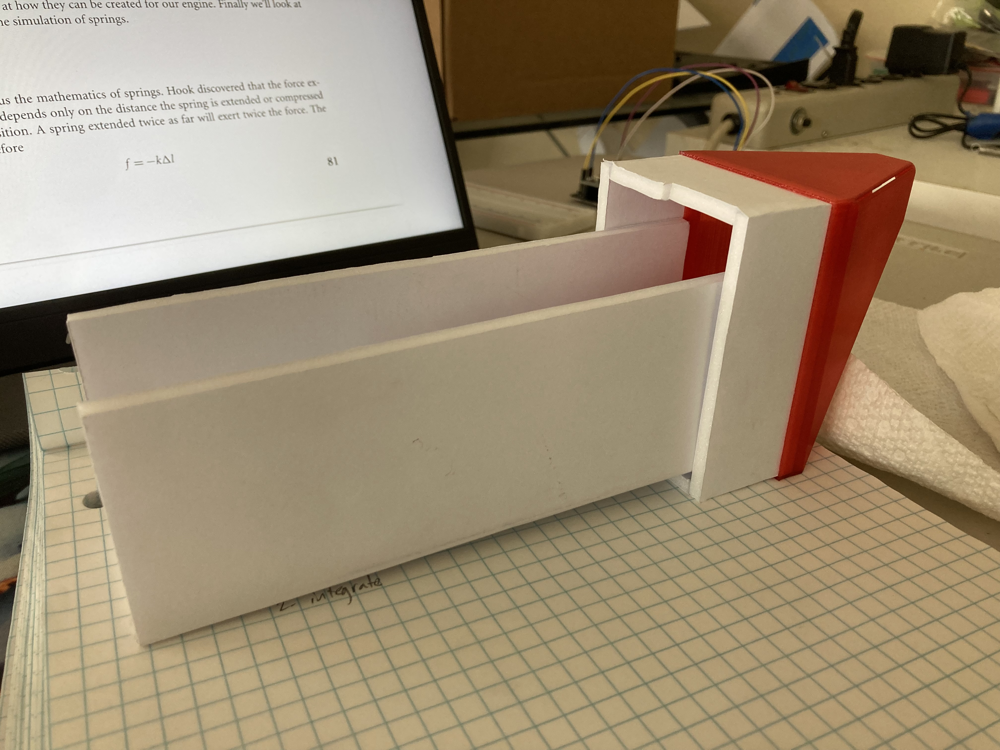
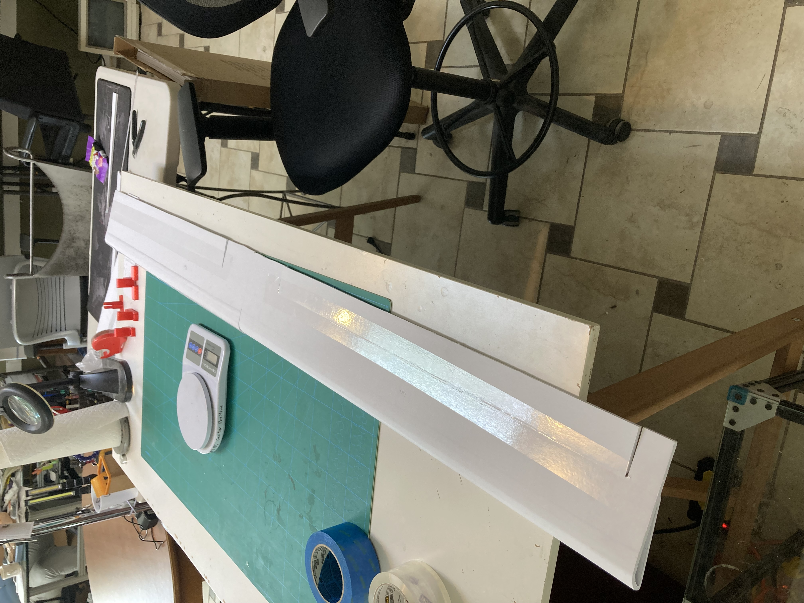
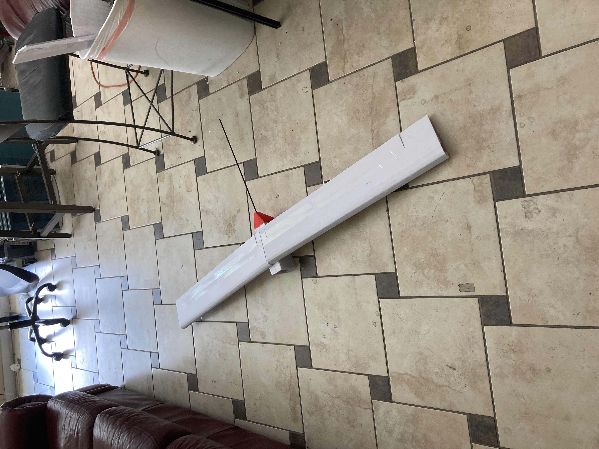
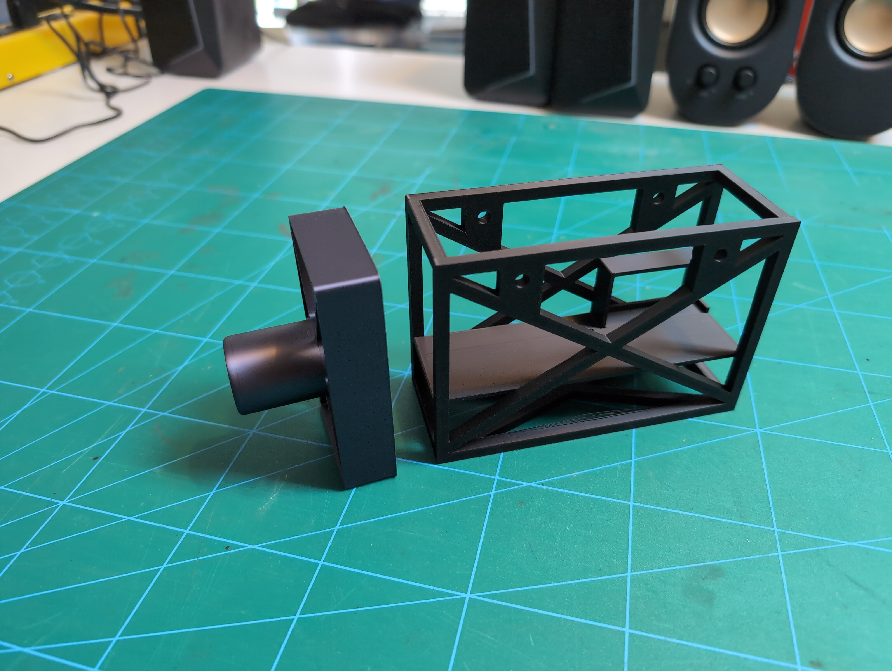
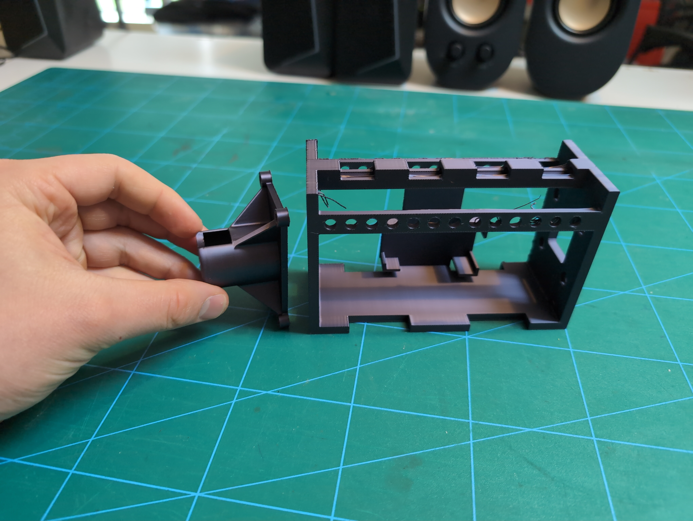

# History

Here is some history of the project to prove I didn't know anything about drones before starting.

Playing around with foam to figure out how big the pod needs to be:  

First Wings:  

Pod and Wings:  

Mockingbird "Payload" first print:  

Mockingbird "Payload" second print:  

Mockingbird prototype wing balancing test:  
