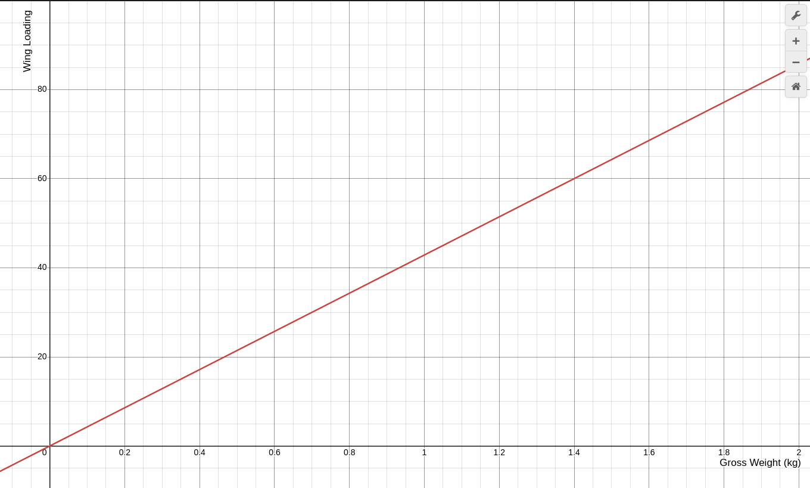
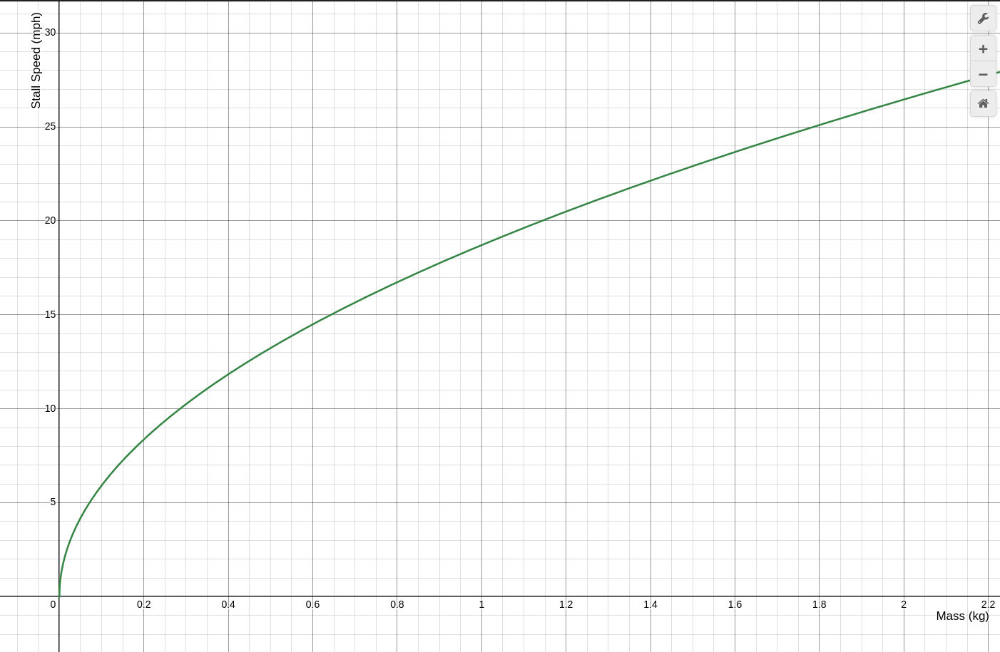

# Wing Specs

- Armin Wing Design
- 2 parts, 10" x 30" foamboard
- assembled dimensions
	- chord: 0.15m
	- wingspan: 1.524m
	- area: 0.2286m^2
- aspect ratio: 15.5 (span over area)
- taper ratio: 1

### Equations
```math
Aspect Ratio = \frac SA
```

```math
\begin{aligned}
Wing Loading = \frac WS \\
Wing Loading = \frac 12 \rho V_{stall}^2 C_{Lift Max}

\end{aligned}
```

### Curves

> Wing Loading Curve  



> Stall Speed Curve  

