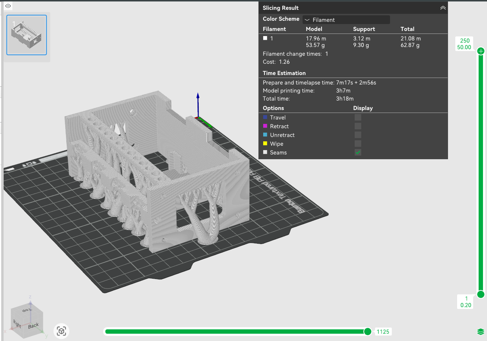

# TODO

1. Electronics Pod
2. Motor Mount
3. Servo Mount
4. Upper attachment thing
5. Fairings

### CAD
- [x] create servo mount
- [x] create Motor mount attachment
- [ ] assemble mocked pod

- [ ] remove material on motor mount so cables can run more easily

### Wing Servo Controls
- [x] test actuation with controller
- [ ] update wing CAD file
    - [ ] attach fairing 14" down wing, 5mm away from leading edge
    - [ ] 7" piano wire length, 70mm actuation distance
    - [ ] 10x20mm hole in the wing next to the fairing
- [ ] is servo direction going to end up mattering? (probably, yes)
- [ ] design left and right wing fairings differently

### Testing
- [ ] assemble entire plane
- [ ] test RC controls

## FLY IT!

- [ ] update all templates with control surface locations and other things
- [ ] combine all templates into printable pdfs
    - [ ] wings
    - [ ] horizontal stabilizer
    - [ ] vertical stabilizer
    - [ ] wing spars
    - [ ] pod
    - [ ] pod spars
    - [ ] payload insert

- [ ] update design documents
- [ ] add obsidian notes to design docs
- [ ] interface control document
- [ ] power budget
- [ ] mass growth allowance
- [ ] TRL assessment
- [ ] iterate

thoughts:
wings need to go on before electronics payload goes in
1. Run servo cables into pod from top
2. Attach wings to pod with rubber bands
3. Connect servo cables to electronics payload
4. Insert electronics payload

Inspirations:
https://www.thingiverse.com/thing:7187147
